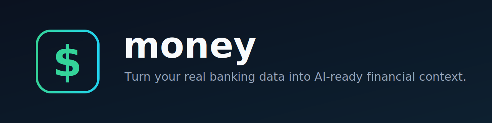
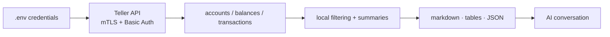

<p align="center">
  
</p>

# money

**Money lets your money talk to you.**

I built `money` as the simplest-possible CLI tool to fetch my bank balances and transaction data so that my AI agents can give me meaningful financial advice grounded in data.

<p>
  <a href="https://github.com/codyhxyz/money/actions/workflows/ci.yml"></a>
  
  <a href="./LICENSE"></a>
  <a href="https://github.com/codyhxyz/money"></a>
</p>

<p align="center">
  
</p>

## About

`money` gives AI assistants the financial context that will help them help you make better financial decisions.

It can include:

- account balances
- recent transactions
- income, spending, and net cash flow
- top spending categories
- top merchants/counterparties
- optional redaction of Teller account and enrollment IDs

The workflow is intentionally boring:

```text
Teller → local CLI → markdown summary → AI conversation
```

`money` is not a budgeting app, a bank dashboard, a sync service, or an agent framework. It does one job: shape your Teller banking data into context an AI assistant can use.

## Getting Started

### Prerequisites

You need:

- Node.js 20 or newer
- a [Teller](https://teller.io) account
- a Teller application certificate and private key
- a Teller access token for your linked bank account

### Quickstart

The first successful run is an AI-ready financial context summary:

```sh
npm run money -- context --days 90
```

For output that is safer to return into an AI conversation, redact Teller account/enrollment IDs:

```sh
npm run money -- context --days 90 --redact-accounts
```

If you are using an AI coding agent, point it at this README and say:

> Set up `github.com/codyhxyz/money` and give me my financial context for the last 90 days.

Your agent can install dependencies and run commands, but only you should provide banking credentials:

1. Download your **Teller certificate + private key** from the Teller Dashboard.
2. Get an **access token** by linking your bank with Teller Connect. You can serve [`examples/login.html`](./examples/login.html) locally, connect in the browser, and copy the token into `.env`.

Redaction does **not** remove transaction amounts, dates, merchants, or categories. Review output before sharing it anywhere public.

### Installation

`money` is currently installed from source:

```sh
git clone https://github.com/codyhxyz/money.git
cd money
npm install
cp .env.example .env
```

Then fill in `.env` with your Teller credentials.

Keep `.env`, certificates, private keys, and tokens out of git. This repo already gitignores common credential paths and PEM/key/cert files.

## Usage

`context` is the default command and the main reason this project exists.

### Commands

| Command | Output |
| --- | --- |
| `npm run money -- context` | AI-ready markdown summary of balances and recent transactions |
| `npm run money -- accounts` | Account and balance table |
| `npm run money -- transactions` | Recent transaction table |

### Examples

```sh
# AI-ready markdown for the last 90 days
npm run money -- context --days 90

# Redact Teller IDs before returning/pasting output
npm run money -- context --days 90 --redact-accounts

# Last 30 days of transactions as JSON
npm run money -- transactions --days 30 --json

# Restrict context to specific accounts
npm run money -- context --account acc_xxx --account acc_yyy

# Print balances as a terminal table
npm run money -- accounts
```

`npm run money -- <command>` is the from-source invocation. After linking or installing the package globally, the binary is `money`, e.g.:

```sh
money context --days 90
```

### Example output

Abbreviated `npm run money -- context --days 90 --redact-accounts` output:

```markdown
# Financial context from Teller

Generated: 2026-06-23T10:04:11.000Z
Window: last 90 days

## Account balances
| Account | Institution | Type | Last 4 | Available | Ledger | Currency |
| --- | --- | --- | --- | --- | --- | --- |
| Checking | Example Bank | checking | 4242 | $12,480.50 | $12,500.00 | USD |

## Transaction summary
- Income: $8,200.00
- Spending: $5,317.42
- Net cash flow: $2,882.58
- Transactions included: 187

## Top spending categories
| Name | Total |
| --- | --- |
| groceries | $1,204.30 |
| restaurants | $612.18 |

## Recent transactions
| Date | Account | Description | Category | Counterparty | Amount | Status |
| --- | --- | --- | --- | --- | --- | --- |
| 2026-06-22 | Checking | WHOLE FOODS MARKET | groceries | Whole Foods | -$72.18 | posted |

Use this as concrete context for financial coaching. Do not infer facts that are not present in the data.
```

## Configuration

| Variable | Required | Purpose |
| --- | --- | --- |
| `TELLER_ACCESS_TOKEN` | yes | Access token from Teller Connect |
| `TELLER_CERT_PATH` / `TELLER_KEY_PATH` | yes* | Paths to certificate/private-key PEM files |
| `TELLER_CERT` / `TELLER_KEY` | yes* | Inline PEM contents; use `\n` escapes |
| `TELLER_APPLICATION_ID` | optional | Used by `examples/login.html` |
| `TELLER_API_BASE_URL` | optional | Defaults to `https://api.teller.io` |

\* Provide credentials either as file paths or inline PEM contents.

Options:

| Flag | Applies to | Default | Purpose |
| --- | --- | --- | --- |
| `--days <n>` | `context`, `transactions` | `90` | Days of transaction history to include |
| `--limit <n>` | `context`, `transactions` | `200` | Maximum transactions to fetch/print |
| `--account <id>` | `context`, `transactions` | all accounts | Limit output to a Teller account ID; repeat for multiple accounts |
| `--json` | all commands | off | Print JSON instead of markdown/table output |
| `--redact-accounts` | `context` | off | Replace Teller account/enrollment IDs with stable placeholders |
| `--env <path>` | global | `.env` | Load configuration from another env file |

## How It Works



Repository map:

```text
src/
├── cli.ts          # commands and flags
├── config.ts       # .env and certificate loading
├── teller.ts       # Teller API client
├── presenter.ts    # markdown, tables, summaries, redaction
├── types.ts        # minimal Teller-shaped types
└── index.ts        # library exports
examples/login.html # Teller Connect token helper
.env.example        # safe config template
```

## Design Philosophy

`money` is inspired by a simple belief: AI financial help gets better when the assistant has real context instead of guesses.

The project values:

- **Concrete context.** Recent transactions, balances, income, spending, merchants, and categories are more useful than vague prompts.
- **Human inspection.** The output is something you can read before deciding whether to paste it into another tool.
- **Composability.** `money` prepares financial context for other tools instead of trying to become the whole financial product.
- **Minimalism.** The core should stay small: fetch data, summarize it, print useful context.
- **Developer friendliness.** Setup should stay approachable for people experimenting with their own financial data.

## Security & Privacy

`money` touches real financial data, so its security model is intentionally narrow:

- runs locally on your machine
- no hosted backend
- no database
- no telemetry
- no credential printing
- direct local process calls to Teller
- sanitized Axios errors so auth headers/request config are not dumped
- fail-closed behavior for missing credentials
- optional account/enrollment ID redaction with `--redact-accounts`

Your trust boundary is still you. The tool prints financial facts to stdout; you decide what gets pasted, returned by an agent, or shared elsewhere.

Do not paste access tokens, certificates, private keys, or real account IDs into GitHub issues.

## Limitations

`money` is deliberately small.

Current scope:

- Teller is the only data source.
- Runs are one-shot; there is no server, persistence, scheduler, or sync daemon.
- Summaries are simple aggregates over a date window.
- There is no budgeting engine, forecasting model, or category-learning system.
- Installation is currently from source.

## Extending / Ideas

Two obvious directions:

1. Use `money` as context input for tools designed around specific financial tasks:
   - budget creation
   - personal finance management
   - cash-flow review
   - spending analysis
   - subscription cleanup
   - financial planning

2. Add support for other banking data providers:
   - [Plaid](https://plaid.com/)
   - [Quiltt](https://www.quiltt.io/)
   - [MX](https://www.mx.com/)

Any of these providers could make sense. Teller is the default here because it works well for a minimalist developer tool: it is straightforward to set up, does not require waiting for approval before experimenting, and is friendly to someone building against their own financial data.

If you want to build one of these, open an issue first so we can decide whether it belongs in core, an example, or a separate project.

## Support

- [GitHub issues](https://github.com/codyhxyz/money/issues) — bugs and feature requests
- This README — setup, usage, security model, and development notes

For bug reports, include:

- the command you ran
- what you expected
- what happened instead
- sanitized error output

Never include credentials or real account identifiers.

## Contributing / Development

Small fixes are welcome, especially improvements that preserve the local-first, minimal shape of the project. Please open an issue before large feature PRs.

```sh
npm install
npm run typecheck
npm run build
npm run dev -- context --days 30
```

## License

[AGPL-3.0-only](./LICENSE) © 2026
