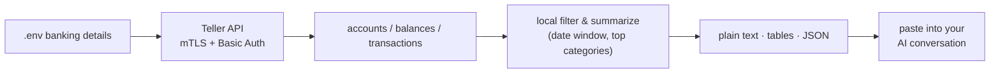

<p align="center">
  
</p>

# money

**Give your AI your real financial picture — then ask it anything.**

`money` is a tiny local CLI that reads your accounts, balances, and recent transactions from the [Teller API](https://teller.io) and lays them out as plain text your AI can read. No server, no database — nothing leaves your machine except a direct call to your bank.

<p>
  <a href="https://github.com/codyhxyz/money/actions/workflows/ci.yml"></a>
  <a href="https://github.com/codyhxyz/money"></a>
  
  <a href="./LICENSE"></a>
</p>

> **What you get.** An informed conversation with your AI about your own finances. `money` hands your AI the facts — balances, spending, recent transactions — as plain text, and your AI does whatever analysis you ask of it.

## What it does & why

You can't get useful financial help from an AI that can't see your money. `money` fixes that: it reads your accounts, balances, and recent transactions from the [Teller API](https://teller.io) and puts them in front of your AI as plain text it can reason over.

The point isn't to predict what you'll ask — it's to get out of the way. `money` makes almost no assumptions about how your AI uses the data, so your AI can answer whatever you actually want to know: where your money went, whether you can afford something, how to think about a goal, what changed this month.

**Design principles:**

- **Local-first.** Runs on your machine; no server, no persistence, no telemetry.
- **Minimal.** One job: get your real financial data in front of your AI. No framework, no bloat.
- **Open by default.** No assumptions about what you'll ask; your AI brings the intelligence.
- **Deterministic output** that's easy to read and easy to diff.
- **Fail closed.** Missing setup stops the run; nothing is ever guessed.

## Quickstart

Ask your AI. Point your assistant at this repository — say something like *"set up `money` from `github.com/codyhxyz/money` and give me my financial context for the last 90 days"* — and it can read this README, install the tool, and run it for you.

The only things it can't do are yours, because they're your banking details:

1. Your **Teller application certificate and private key** — get them from the [Teller Dashboard](https://teller.io).
2. Your **access token** — link a bank with Teller Connect. Your agent can open [`examples/login.html`](./examples/login.html) for you; you connect your bank in the browser, and the token appears to copy into `.env`.

Your agent then runs the whole flow:

```bash
pnpm install
cp .env.example .env      # agent fills this with your banking details — never committed
pnpm teller context --days 90
pnpm teller context --days 90 --redact-accounts   # safe to share anywhere
```

…and hands you back the result, or pastes it straight into the conversation you're already in. That's the entire loop.

<details>
<summary><strong>Example: what your AI gets</strong></summary>

Illustrative, redacted sample of <code>money context --days 90 --redact-accounts</code>:

```markdown
# Financial context from Teller

Generated: 2026-06-23T10:04:11.000Z
Window: last 90 days

## Account balances
| Account | Institution | Type | Last 4 | Available | Ledger | Currency |
| --- | --- | --- | --- | --- | --- | --- |
| Checking | Example Bank | checking | 4242 | $12,480.50 | $12,500.00 | USD |
| Savings | Example Bank | savings | 8810 | $48,210.00 | $48,210.00 | USD |

## Transaction summary
- Income: $8,200.00
- Spending: $5,317.42
- Net cash flow: $2,882.58
- Transactions included: 187

## Top spending categories
| Name | Total |
| --- | --- |
| groceries | $1,204.30 |
| restaurants | $612.18 |
| transport | $403.55 |
| subscriptions | $198.99 |

## Top counterparties / merchants
| Name | Total |
| --- | --- |
| Whole Foods | $486.12 |
| Uber | $311.40 |
| Spotify | $98.97 |

## Recent transactions
| Date | Account | Description | Category | Counterparty | Amount | Status |
| --- | --- | --- | --- | --- | --- | --- |
| 2026-06-22 | Checking | WHOLE FOODS MARKET | groceries | Whole Foods | -$72.18 | posted |
| 2026-06-21 | Checking | UBER TRIP | transport | Uber | -$23.40 | posted |
| 2026-06-15 | Checking | PAYROLL DEPOSIT | income | Acme Corp | $4,100.00 | posted |

Use this as concrete context for financial coaching. Do not infer facts that are not present in the data.
```

</details>

## Commands

`context` is the default command — that's all most people need. The rest are for inspecting raw data.

| Command | What it prints |
| --- | --- |
| `money context` *(default)* | A plain-text summary of balances + recent transactions |
| `money accounts` | Accounts and balances as a table |
| `money transactions` | Recent transactions as a table |

**Flags:**

| Flag | Applies to | Default | Purpose |
| --- | --- | --- | --- |
| `--days <n>` | `context`, `transactions` | `90` | How many days of history to include |
| `--limit <n>` | `context`, `transactions` | `200` | Max transactions to fetch/print |
| `--account <id>` *(repeatable)* | `context`, `transactions` | all | Limit to specific account IDs |
| `--json` | all | off | Print raw JSON instead of human/agent format |
| `--redact-accounts` | `context` | off | Replace Teller account/enrollment IDs with `account_1`, `account_2`, … |
| `--env <path>` | global | `.env` | Path to your env file |

```bash
pnpm teller context --days 90 --limit 200
pnpm teller transactions --days 30 --json
pnpm teller context --account acc_xxx --account acc_yyy
pnpm teller context --redact-accounts        # before sharing anywhere
```

> **Note:** `pnpm teller` runs via `tsx`. Once installed globally/linked, the binary is just `money`.

## Output formats

`money` speaks three formats so it slots into whichever way you work with your AI:

- **Plain text** (`context`) — paste into any chat or agent. Grounded, structured, concise.
- **Tables** (`accounts`, `transactions`) — read it yourself in the terminal.
- **JSON** (`--json`) — feed to another tool, script, or agent that wants the raw shape.

## How it works



| Entity | Source | Role in `money` |
| --- | --- | --- |
| You | the human | Holds banking details and decides what to share |
| Enrollment | Teller Connect access token | Grants API access — never printed |
| Account | `GET /accounts` | Maps your institution accounts |
| Balance | `GET /accounts/:id/balances` | Current cash/debt position |
| Transaction | `GET /accounts/:id/transactions` | Income/spend history |
| AI context | local output | Portable summary for an agent conversation |

**Repository layout:**

```text
src/
├── cli.ts          # commands & flags (commander)
├── config.ts       # .env + certificate loading
├── teller.ts        # Teller API client (mTLS + Basic Auth)
├── presenter.ts     # plain text/tables/summaries + redaction
├── types.ts         # minimal Teller-shaped types
└── index.ts         # library exports
examples/login.html  # Teller Connect token helper
.env.example         # safe config template
```

## Configuration

Copy the template and fill in your banking details:

```bash
cp .env.example .env
```

| Variable | Required | Purpose |
| --- | --- | --- |
| `TELLER_ACCESS_TOKEN` | yes | Access token from Teller Connect |
| `TELLER_CERT_PATH` / `TELLER_KEY_PATH` | yes* | Paths to your certificate/private-key PEM files |
| `TELLER_CERT` / `TELLER_KEY` | yes* | Or inline PEM contents (use `\n` escapes) |
| `TELLER_APPLICATION_ID` | optional | Used by `examples/login.html` only |
| `TELLER_API_BASE_URL` | optional | Defaults to `https://api.teller.io` |

\* Provide your certificate and key **either** as file paths **or** as inline PEM — one of the two is required.

Keep them out of git (e.g. in an ignored `./certs/` directory). `.gitignore` already excludes `.env`, `certs/`, and PEM/key/crt files.

## Trust & privacy

This reads your real banking data, so the real question is whether you can trust it — and Teller — with that. Here's the basis for deciding:

- Your data goes only to Teller's API and back to your terminal. No third parties, no logging, no telemetry.
- Everything runs on your machine; there's no server, no database, nothing kept between runs.
- Your banking details are never printed, are gitignored by default, and error messages are cleaned up so they never leak into output.
- Missing setup stops the run cold — it never guesses or proceeds without what it needs.
- Use `--redact-accounts` before sharing output anywhere you don't want your account identifiers exposed.

You stay in control: your banking details live on your machine, and you decide what gets shared and where.

## Development

For contributors (separate from the everyday flow above):

```bash
pnpm install
pnpm typecheck     # tsc --noEmit
pnpm build         # compile to dist/
pnpm dev <cmd>     # run via tsx without building, e.g. pnpm dev context
```

The CLI program is wired in [`src/cli.ts`](./src/cli.ts); the Teller client in [`src/teller.ts`](./src/teller.ts); all output shaping in [`src/presenter.ts`](./src/presenter.ts).

## Roadmap & limitations

`money` is deliberately small. Current scope and known limits:

- Teller is the only data source.
- Summaries are aggregates over a date window — no categorization learning, no budgets, no forecasts.
- No server, no persistence, no scheduling; runs are one-shot.
- Distributed from GitHub only — install from source (a deliberate choice, not a TODO).

## Contributing

Issues and pull requests are welcome at [`codyhxyz/money`](https://github.com/codyhxyz/money). For bugs, include the command you ran and the sanitized error output (never your banking details). Keep changes minimal and aligned with the design principles above.

## License

[MIT](./LICENSE) © 2026
