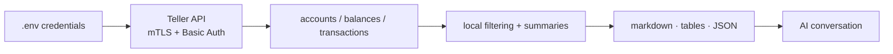

# teller-cli

I built `teller-cli` as the simplest-possible CLI tool to fetch my bank balances and transaction data so that my AI agents can give me meaningful financial advice.

<p>
  <a href="https://github.com/codyhxyz/money/actions/workflows/ci.yml"></a>
  
  <a href="./LICENSE"></a>
  <a href="https://github.com/codyhxyz/money"></a>
</p>


## What this isn't

`teller-cli` is not a budgeting app. It is not a YNAB or Rocket Money replacement. It just prints transaction and balance data to the console. 
The design philosophy for this tool was inspired by Mario Zechner's pi: keep the system as minimal as possible, with an eye for making it modular and extensible. AI agents can use this to do awesome stuff. You can't imagine all of what users will want from it, so don't overbuild. Restraint enables users to extend your tool into their own bespoke software.

## Whyyy do I need this
You *could* just use the Teller API directly, I won't stop you. But this repo handles all of the following for you, making it an easy starting point for building your own personal financial advisor:
 - credential/env setup in one place
 - mTLS handled
 - account + balance + transaction fetching combined
 - date/window filtering
 - spending/income/net summaries
 - category/merchant rollups
 - markdown output for AI
 - optional JSON for scripts
 - safer error handling/redaction defaults

## Getting Started

### Quickstart

If you are using an AI coding agent, point it at this README and say:

> Set up `github.com/codyhxyz/money` and give me my financial context for the last 90 days.

Your agent can install dependencies and run commands, but only you should provide banking credentials:

1. Download your **Teller certificate + private key** from the Teller Dashboard.
2. Get an **access token** by linking your bank with Teller Connect. You can serve [`examples/login.html`](./examples/login.html) locally, connect in the browser, and copy the token into `.env`.

Redaction does **not** remove transaction amounts, dates, merchants, or categories. Review output before sharing it anywhere public.

### Prerequisites

You need:

- Node.js 20 or newer
- a [Teller](https://teller.io) account
- a Teller application certificate and private key
- a Teller access token for your linked bank account

### Installation

`money` is currently installed from source:

```sh
git clone https://github.com/codyhxyz/money.git
cd money
npm install
cp .env.example .env
```

Then fill in `.env` with your Teller credentials.

Keep `.env`, certificates, private keys, and tokens out of git. This repo already gitignores common credential paths and PEM/key/cert files.

## Usage

| Command | Output |
| --- | --- |
| `npm run money -- context` | AI-ready markdown summary of balances and recent transactions |
| `npm run money -- accounts` | Account and balance table |
| `npm run money -- transactions` | Recent transaction table |


## How It Works




## Security & Privacy

This is a minimal, local wrapper around Teller. I don't touch your data, that's between you and Teller.


## Limitations

Current scope:

- Teller is the only data source.
- There is no scheduled sync or database.
- There is no frontend that would make all of this look pretty.
- There are no convenience features for transaction clustering.

## Extending my work

Two obvious directions you can take this project:

1. Extend the tool for specific financial uses:
   - budget creation
   - cash-flow review
   - spending analysis
   - subscription cleanup
   - financial planning

2. Add support for other banking data providers:
   - [Plaid](https://plaid.com/)
   - [Quiltt](https://www.quiltt.io/)
   - [MX](https://www.mx.com/)


## License

[AGPL-3.0-only](./LICENSE) © 2026
